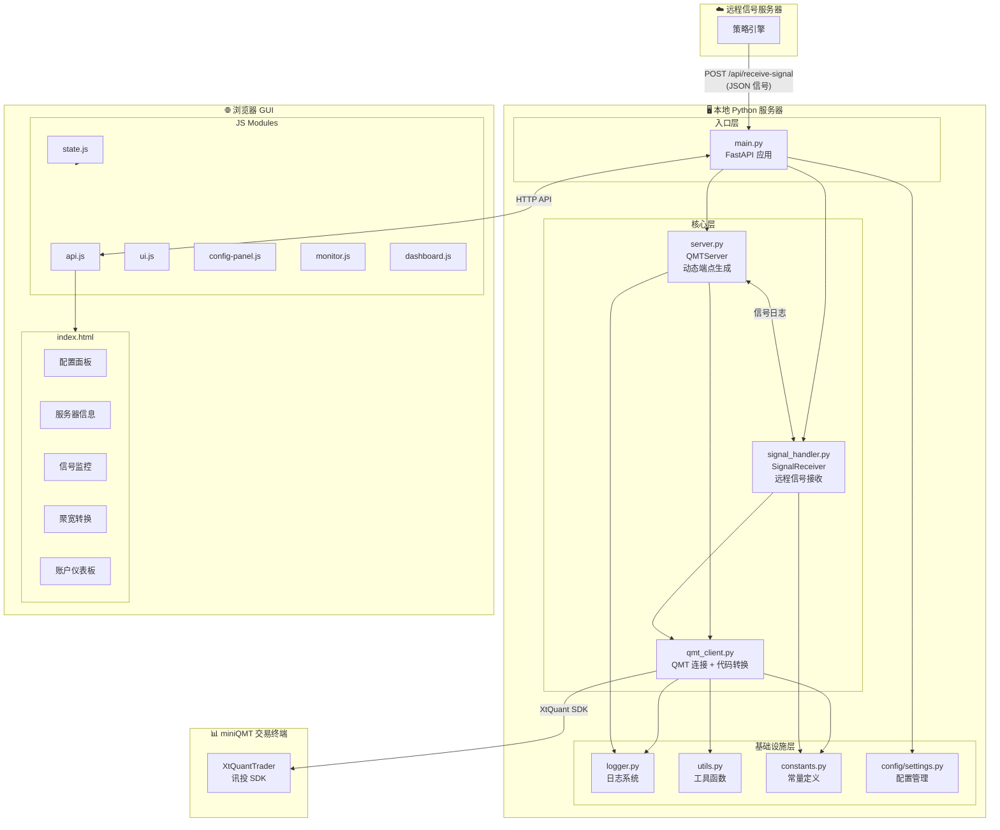
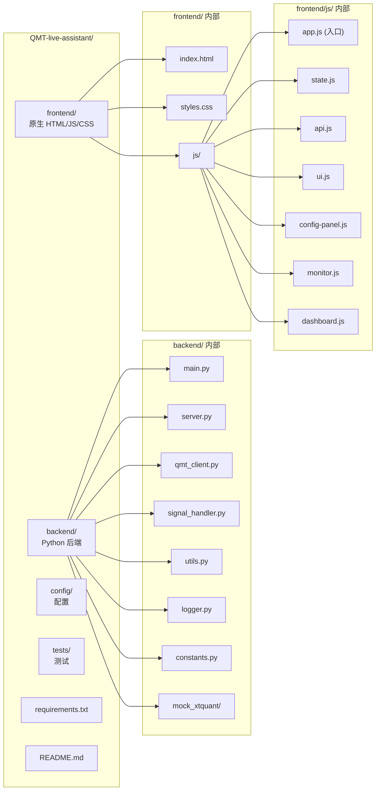
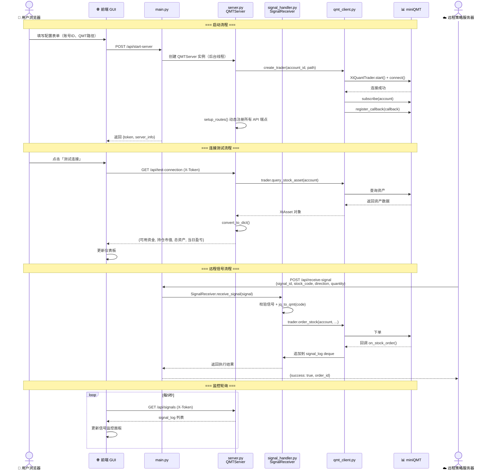
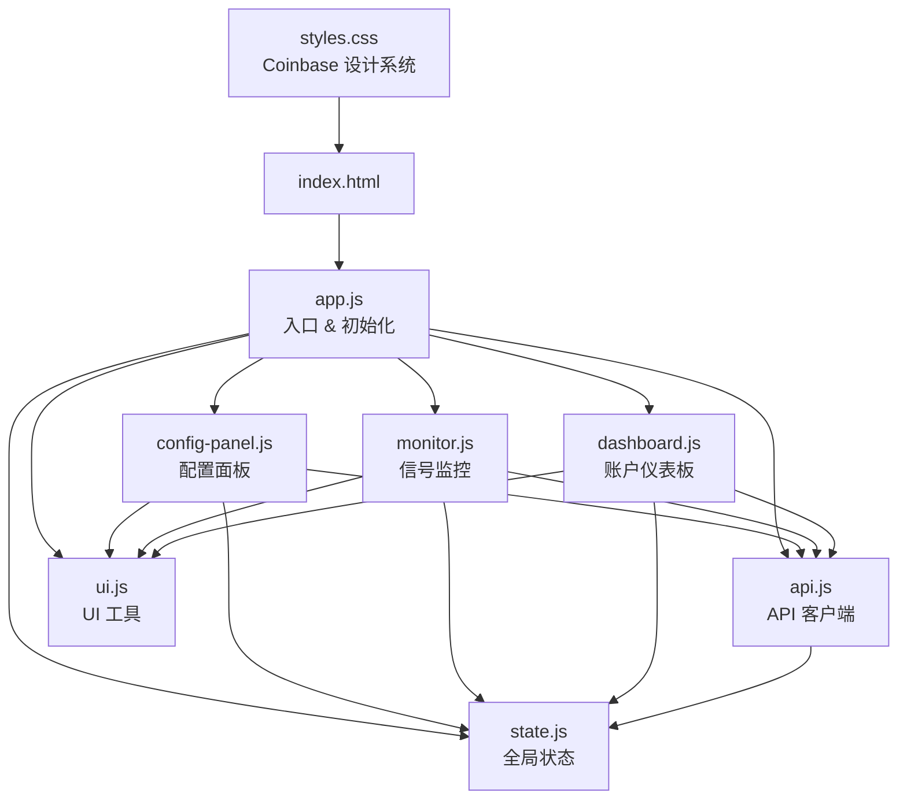
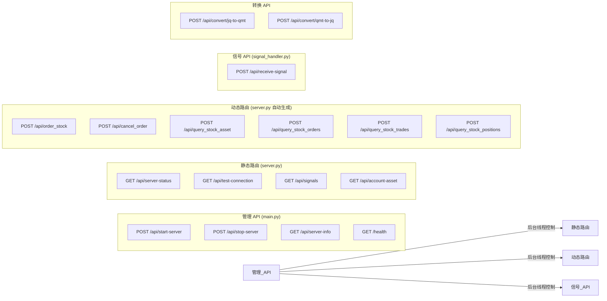

# QMT-live-assistant 实现方案

## Context

根据 PR.md 需求，构建一个基于 Python 服务器 + 原生 HTML 前端的 miniQMT 量化交易助手。Python 服务器代码参考 `../qka` 项目，UI 设计采用 DESIGN.md 中定义的 Coinbase 风格。项目 MVP 包括：启动 miniQMT 连接、测试获取可用资金、聚宽代码转换、信号监控。

## 技术栈

- **后端**: Python 3.10+ / FastAPI / uvicorn / xtquant SDK
- **前端**: 原生 HTML + CSS + JS（无框架，ES Module）
- **设计**: Coinbase 设计系统（#0052ff 主色，Inter 字体，pill 按钮，24px 卡片圆角）

## 项目架构图示

### 1. 整体系统架构



### 2. 项目目录结构



### 3. 核心数据流



### 4. 前端模块依赖图



### 5. API 路由拓扑



---

## 后端架构

### 1. `config/settings.py` — 配置层
- 从环境变量读取：SERVER_HOST, SERVER_PORT, MINI_QMT_PATH, ACCOUNT_ID, SECRET_KEY, LOG_LEVEL, WECHAT_WEBHOOK_URL
- 提供合理的默认值
- 导出单例 settings 对象

### 2. `backend/constants.py` — 常量
- ANSI 颜色码（RED, GREEN, YELLOW, BLUE, RESET）
- 订单状态映射（48→未报, 56→已成 等）
- 买卖方向映射

### 3. `backend/logger.py` — 日志（qka 模式）
- `create_logger(name)` — 控制台 handler + 按日文件轮转（logs/YYYY-MM-DD.log）
- `WeChatHandler(logging.Handler)` — 企业微信 webhook 推送
- `add_wechat_handler(logger, level, webhook_url)`

### 4. `backend/utils.py` — 工具函数（qka 模式）
- `add_stock_suffix(code)` — 6位代码补全后缀（600000→600000.SH）
- `timestamp_to_datetime_string(ts)` — 时间戳转字符串
- `parse_order_type(order_type)` — 订单类型 int→中文

### 5. `backend/qmt_client.py` — QMT 连接层
遵循 qka `trade.py` 的精确模式：
- `MyXtQuantTraderCallback(XtQuantTraderCallback)` — 回调处理器
  - `on_disconnected()`, `on_stock_order()`, `on_stock_trade()`, `on_order_error()`, `on_cancel_error()`
  - 将事件追加到共享的 `signal_log` deque 中
- `create_trader(account_id, mini_qmt_path)` → `(trader, account, callback)`
  - `session_id = random.randint(100000, 999999)`（qka 模式）
  - `xt_trader = XtQuantTrader(path, session_id)`
  - `xt_trader.start()` → `xt_trader.connect()`
  - `account = StockAccount(account_id)`
  - `xt_trader.subscribe(account)`（qka 模式）
  - `xt_trader.register_callback(callback)`
- `jq_to_qmt(code)` / `qmt_to_jq(code)` — 聚宽格式转换
  - XSHE→SZ, XSHG→SH, XBJ→BJ

### 6. `backend/server.py` — 核心服务器（qka 模式）
`QMTServer` 类：
- `__init__(self, account_id, mini_qmt_path, host, port, token=None)`
- `generate_token()` — SHA256(MAC地址) 生成确定性 token
- `verify_token(x_token)` — FastAPI 依赖，校验 X-Token header
- `init_trader()` — 调用 create_trader，设置 self.trader, self.account, self.callback
- `convert_to_dict(obj)` — 递归转换 XtQuant 返回对象为 dict
- `convert_method_to_endpoint(method_name, method)` — 动态端点生成
  - 用 inspect 分析方法签名，排除 self 和 account
  - 动态创建 Pydantic BaseModel
  - 注册 `POST /api/{method_name}`，自动注入 account
- `setup_routes()` — 遍历 trader 所有公开方法，注册动态端点；注册静态路由
  - `GET /api/server-status` — 服务器状态
  - `GET /api/test-connection` — 测试连接（调用 query_stock_asset）
  - `GET /api/signals` — 获取信号历史
  - `GET /api/account-asset` — 获取账户资产
- `start()` — init_trader → setup_routes → uvicorn.run
- `stop()` — 清理

### 7. `backend/signal_handler.py` — 远程信号接收
`TradeSignal` Pydantic 模型：
- signal_id, stock_code (聚宽格式), direction (buy/sell), quantity, price (可选), order_type, strategy_name, timestamp

`SignalReceiver` 类：
- `receive_signal(signal)` → 验证 → 代码转换 → 下单 → 记录日志 → 返回结果
- 端点：`POST /api/receive-signal`（受 token 保护）

### 8. `backend/main.py` — 应用入口
- 创建 FastAPI app，配置 CORS 中间件
- 挂载 `../frontend/` 到静态文件
- `GET /` 提供 index.html
- 管理 API：`POST /api/start-server`, `POST /api/stop-server`, `GET /api/server-info`
- 后台线程运行 QMTServer
- CLI 入口：argparse 支持 --account --qmt-path --host --port --token

### 9. `backend/mock_xtquant/__init__.py` — Mock 层
- `MockTrader`: connect(), query_stock_asset() 返回模拟资产数据
- `MockStockAccount`: account_id 属性
- `MockData`: set_qmt_data_dir()
- `MockTraderCallback`: 基类

---

## 前端架构

### HTML 结构（5个区域，Coinbase 96px 区块间距）

```
.top-nav          — 固定顶部导航（Logo + 导航链接 + 主题切换）
.main-content
  #config         — 服务器配置表单（账号ID、QMT路径、主机、端口）
  #server-info    — 服务器状态卡片（状态、Token、连接信息）
  #signal-monitor — 信号监控面板（实时信号列表，核心区域）
  #jq-converter   — 聚宽代码转换工具
  #dashboard      — 账户仪表板（可用资金、持仓市值、总资产、当日盈亏）
.footer           — 页脚
```

### CSS 设计系统（来自 DESIGN.md）
- CSS 自定义属性：颜色、字体、间距、圆角、阴影
- 主色 #0052ff，仅用于主 CTA 和强调
- 按钮：pill 圆角（100px），44px 高度主按钮
- 卡片：24px 圆角，32px 内边距
- 字体：Inter（正文）、JetBrains Mono（数字）
- 亮/暗双主题（`[data-theme="dark"]`）
- 响应式：1024px / 768px / 480px 断点

### JS 模块设计

**`state.js`** — 全局状态
```
serverRunning, token, serverInfo, signals[], theme, pollingInterval
```

**`api.js`** — API 客户端
```
startServer(config), stopServer(), getServerInfo(), testConnection(token),
getSignals(token), getAccountAsset(token), convertJqToQmt(code), healthCheck()
```

**`ui.js`** — UI 工具
```
showMessage(text, type), updateServerInfo(data), resetServerInfo(),
addSignal(signal), clearSignals(), toggleTheme(), initTheme(),
disableForm(bool), updateDashboard(data), formatCurrency(n)
```

**`config-panel.js`** — 配置面板
- 表单提交处理
- 启动/停止服务器按钮逻辑
- 输入验证

**`monitor.js`** — 信号监控
- 实时信号列表渲染（时间戳、信号ID、股票代码、方向标签、数量、价格、状态）
- 每 5 秒轮询 `/api/signals`
- 最多保留 200 条
- 方向颜色：买入绿色、卖出红色

**`dashboard.js`** — 仪表板
- 4 张卡片：可用资金、持仓市值、总资产、当日盈亏
- 数字使用 JetBrains Mono 字体
- 点击"刷新"或连接测试成功后更新

---

## 实现顺序

### Phase 1: 项目基础搭建
1. 创建目录结构
2. `requirements.txt`（fastapi, uvicorn, pydantic, xtquant, pytest, pytest-asyncio, httpx）
3. `config/settings.py`

### Phase 2: 后端核心（qka 模式）
4. `backend/constants.py`
5. `backend/utils.py`
6. `backend/logger.py`
7. `backend/qmt_client.py`
8. `backend/mock_xtquant/__init__.py`
9. `backend/server.py`

### Phase 3: 后端信号功能
10. `backend/signal_handler.py`
11. `backend/main.py`

### Phase 4: 后端测试
12. `tests/test_client.py`
13. `tests/test_server.py`
14. `tests/test_signal_handler.py`

### Phase 5: 前端
15. `frontend/styles.css`
16. `frontend/index.html`
17. `frontend/js/state.js` → `api.js` → `ui.js`
18. `frontend/js/config-panel.js` → `monitor.js` → `dashboard.js`
19. `frontend/js/app.js`

### Phase 6: 集成与文档
20. 集成测试验证
21. `README.md`

---

## 验证方案

1. **后端测试**：`pytest tests/ -v` 验证所有单元测试通过
2. **Mock 模式启动**：在 macOS 上 `python -m backend.main --account test --qmt-path /tmp/mock` 验证服务器启动成功
3. **前端验证**：浏览器打开 `http://localhost:8000`，验证 UI 渲染和 API 交互
4. **信号测试**：`curl -X POST http://localhost:8000/api/receive-signal -H "X-Token: <token>" -H "Content-Type: application/json" -d '{"signal_id":"test-001","stock_code":"000001.XSHE","direction":"buy","quantity":100}'` 验证信号接收
5. **代码转换**：验证 jq_to_qmt 和 qmt_to_jq 转换正确性
