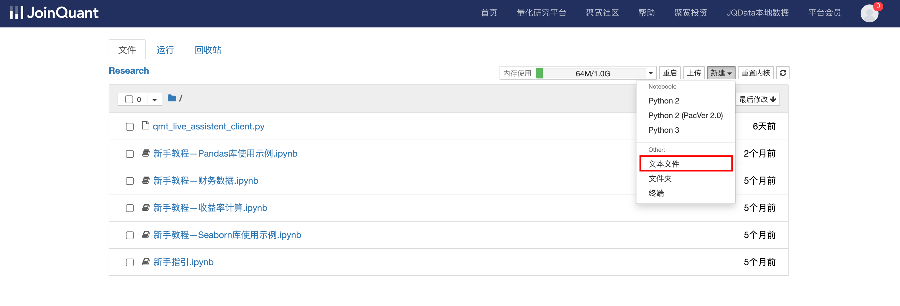
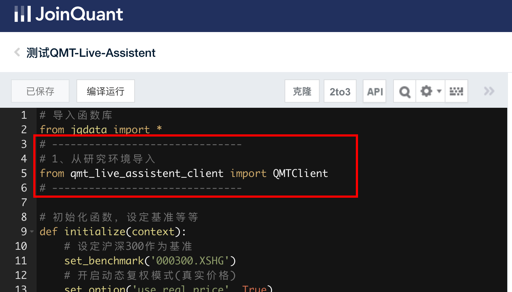
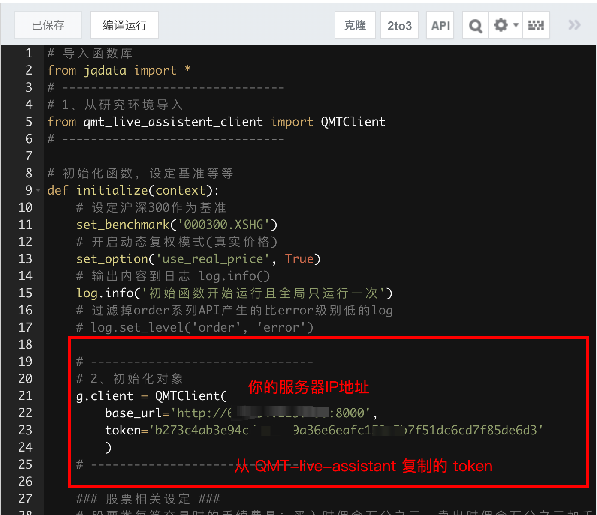
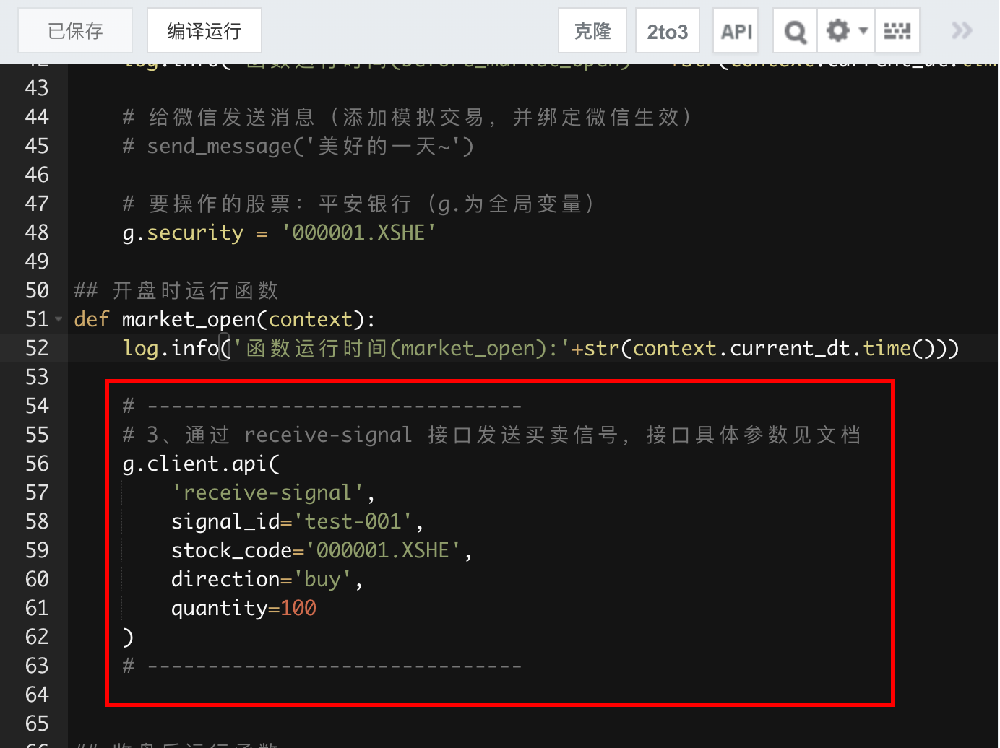

# 在聚宽发送信号给 QMT-Live-Assistant

## 1、整体思路

```
聚宽 → HTTP 信号 → QMT-Live-Assistant → miniQMT 下单
```


## 2、具体操作步骤

### 2.1 在研究环境新建文本文件



将如下代码复制到文件里保存：
```python
import requests
from typing import Any

class QMTClient:
    """QMT客户端最小内核版本 - 仅保留client.api核心功能"""

    def __init__(self, base_url: str = "http://localhost:8000", token: str = None):
        """初始化交易客户端

        Args:
            base_url: API服务器地址，默认为本地8000端口
            token: 访问令牌，必须与服务器的token一致
        """
        if not token:
            raise ValueError("必须提供访问令牌(token)")

        self.base_url = base_url.rstrip('/')
        self.token = token
        self.session = requests.Session()
        self.headers = {
            "X-Token": self.token,
            "Content-Type": "application/json"
        }

    def api(self, method_name: str, **params) -> Any:
        """通用调用接口方法

        Args:
            method_name: 要调用的接口名称
            **params: 接口参数，作为关键字参数传入

        Returns:
            接口返回的数据

        Raises:
            Exception: API调用失败或服务器返回错误
        """
        try:
            response = self.session.post(
                f"{self.base_url}/api/{method_name}",
                json=params or {},
                headers=self.headers
            )
            response.raise_for_status()
            result = response.json()

            if not result.get('success'):
                raise Exception(f"API调用失败: {result.get('detail')}")

            return result.get('data')

        except requests.RequestException as e:
            raise Exception(f"网络请求失败: {str(e)}")
        except Exception as e:
            raise Exception(f"调用 {method_name} 失败: {str(e)}")
```

### 2.2 在策略回测中发送信号

1、引入在研究环境中的文件



2、初始化对象



3、发送信号到 QMT-live-assistant




完整使用示例如下：

```python
# 导入函数库
from jqdata import *
# -------------------------------
# 1、从研究环境导入
from qmt_live_assistent_client import QMTClient
# -------------------------------

# 初始化函数，设定基准等等
def initialize(context):
    # 设定沪深300作为基准
    set_benchmark('000300.XSHG')
    # 开启动态复权模式(真实价格)
    set_option('use_real_price', True)
    # 输出内容到日志 log.info()
    log.info('初始函数开始运行且全局只运行一次')
    # 过滤掉order系列API产生的比error级别低的log
    # log.set_level('order', 'error')
    
    # -------------------------------
    # 2、初始化对象
	g.client = QMTClient(
	    base_url='http://62.234.223.195:8000', 
	    token='b273c4ab3e94cdec9ac9a36e6eafc159c5b7f51dc6cd7f85de6d3'
	    )
    # -------------------------------
    
    ### 股票相关设定 ###
    # 股票类每笔交易时的手续费是：买入时佣金万分之三，卖出时佣金万分之三加千分之一印花税, 每笔交易佣金最低扣5块钱
    set_order_cost(OrderCost(close_tax=0.001, open_commission=0.0003, close_commission=0.0003, min_commission=5), type='stock')

    ## 运行函数（reference_security为运行时间的参考标的；传入的标的只做种类区分，因此传入'000300.XSHG'或'510300.XSHG'是一样的）
      # 开盘前运行
    run_daily(before_market_open, time='before_open', reference_security='000300.XSHG')
      # 开盘时运行
    run_daily(market_open, time='open', reference_security='000300.XSHG')
      # 收盘后运行
    run_daily(after_market_close, time='after_close', reference_security='000300.XSHG')

## 开盘前运行函数
def before_market_open(context):
    # 输出运行时间
    log.info('函数运行时间(before_market_open)：'+str(context.current_dt.time()))

    # 给微信发送消息（添加模拟交易，并绑定微信生效）
    # send_message('美好的一天~')

    # 要操作的股票：平安银行（g.为全局变量）
    g.security = '000001.XSHE'

## 开盘时运行函数
def market_open(context):
    log.info('函数运行时间(market_open):'+str(context.current_dt.time()))
    security = g.security
    # 获取股票的收盘价
    close_data = get_bars(security, count=5, unit='1d', fields=['close'])
    # 取得过去五天的平均价格
    MA5 = close_data['close'].mean()
    # 取得上一时间点价格
    current_price = close_data['close'][-1]
    # 取得当前的现金
    cash = context.portfolio.available_cash
    
    # -------------------------------
    # 3、通过 receive-signal 接口发送买卖信号，接口具体参数见文档
    g.client.api(
		'receive-signal',
		signal_id='test-001',
		stock_code='000001.XSHE',
		direction='buy',
		quantity=100
	)
    # -------------------------------
   

## 收盘后运行函数
def after_market_close(context):
    log.info(str('函数运行时间(after_market_close):'+str(context.current_dt.time())))
    #得到当天所有成交记录
    trades = get_trades()
    for _trade in trades.values():
        log.info('成交记录：'+str(_trade))
    log.info('一天结束')
    log.info('##############################################################')

```