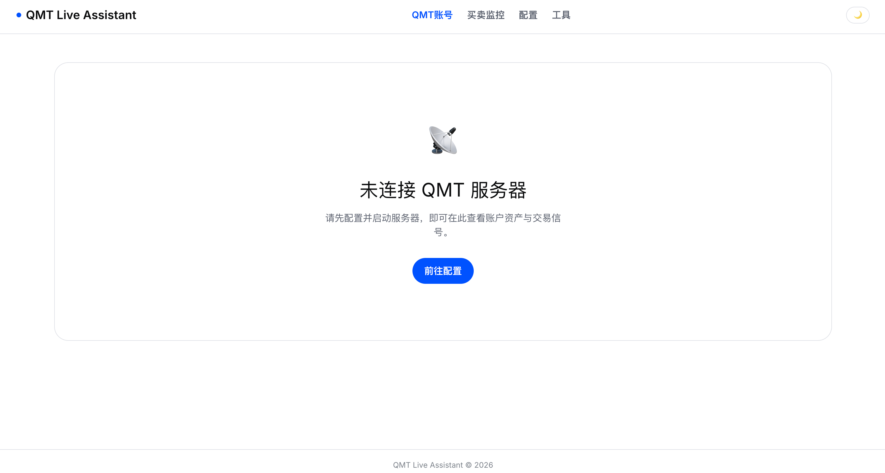
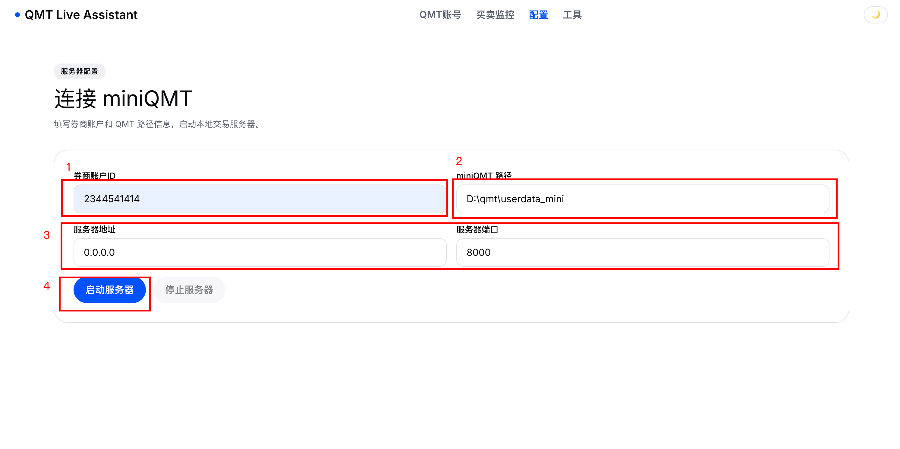
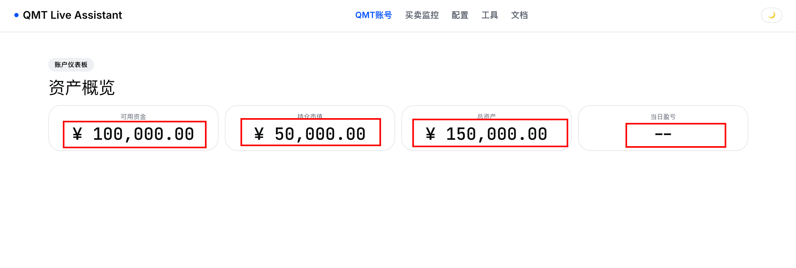
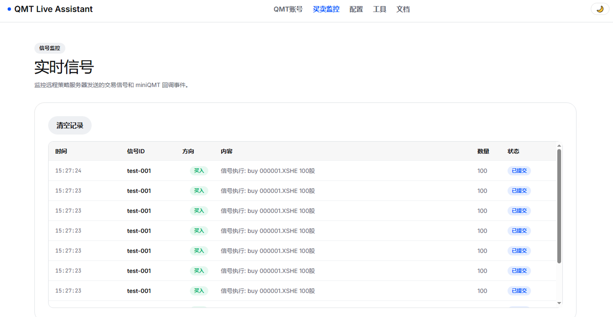

# QMT-Live-Assistant 使用指南

## 1、适用场景

QMT-Live-Assistant 适用于以下量化交易工作流：

1. 在聚宽（JoinQuant）上进行研究、回测和模拟交易
2. 策略信号需要转发到实盘 miniQMT 执行

```
聚宽 → HTTP 信号 → QMT-Live-Assistant → miniQMT 下单
```


## 2、下载 QMT-Live-Assistant

### 前提条件

- Windows 操作系统（xtquant SDK 仅支持 Windows）
- 已安装 Python 3.10+
- 已安装、选中“独立交易”，并登录 QMT 交易终端（券商版）

### 安装依赖

```bash
git clone https://github.com/Dada-liu/QMT-Live-Assistant.git
cd QMT-Live-Assistant
pip install -r requirements.txt
```

> 在 macOS/Linux 上开发调试时，项目自动使用 mock 模块模拟 XtQuant 接口。


## 3、启动 QMT-Live-Assistant

1、windows 下启动CMD，进入 QMT Live Assistant 项目根目录，执行如下启动命令
```bash
python -m backend.main --port 8000
```

详细教程见项目 README；

2、浏览器打开 [http://localhost:8000](http://localhost:8000)

3、点击“前往配置“



4、填写账户 ID（券商资金账号）和 QMT 路径

在【配置】页面，填写完账户 ID（券商资金账号）和 QMT 路径之后，点击“启动服务器"按钮；



5、查看账户资金状况

点击“启动服务器"按钮之后，会自动跳转到【QMT账号】下，如果连击 miniQMT 成功就可以看到资产概览中有数据



6、在 聚宽 配置，发送信号到 QMT Live Assistant

具体内容见另一篇文章：【聚宽如何发送信号给 QMT-Live-Assistant】

7、查看买卖日志

在【买卖监控】下，可以看到所有的远程发送的买卖记录；



## 4、接口的具体实现

### /receive-signal 接口格式

远程策略服务器向 `POST /api/receive-signal` 发送 JSON：

```json
{
  "signal_id": "sig-20260531-001",
  "stock_code": "000001.XSHE",
  "direction": "buy",
  "quantity": 100,
  "price": 12.50,
  "order_type": "limit",
  "strategy_name": "momentum-v1"
}
```

### 认证方式

请求头携带策略 Token：`X-Token: <策略Token>`

服务器根据 Token 识别策略，下单后自动更新该策略的持仓和资金数据。

### 接口各字段说明

| 字段 | 类型 | 必填 | 说明 |
|------|------|------|------|
| signal_id | string | 是 | 信号唯一标识，用于去重 |
| stock_code | string | 是 | 聚宽格式股票代码（如 000001.XSHE） |
| direction | string | 是 | buy 或 sell |
| quantity | number | 是 | 下单数量（股） |
| price | number | 否 | 限价单价格，不填则为市价单 |
| order_type | string | 是 | limit（限价）或 market（市价） |
| strategy_name | string | 否 | 策略名称，用于前端展示 |


## 5、安全注意事项

- 服务器主 Token 每次启动随机生成，仅在 `/api/start-server` 响应中返回一次
- 每个策略的 Token 独立生成，创建后立即展示一次，**务必复制保存**
- Token 存储在前端 Session Storage 中，关闭标签页即清除
- 不要在公网暴露服务器端口，建议仅监听 127.0.0.1
- 若需远程访问，务必配置防火墙规则或使用 VPN


## 6、常见问题

**Q: 连接 QMT 失败？**
- 确认 QMT 交易终端已登录
- 检查 QMT 路径是否正确（路径指向 `userdata_mini` 目录）
- 确认账户 ID 无误

**Q: 信号发送成功但没有下单？**
- 检查 `direction` 字段是否为 `buy` 或 `sell`
- 检查策略是否启用（`enabled: true`）
- 查看服务器日志确认具体错误

**Q: mac 上能运行吗？**
- 可以运行服务器和前端进行开发调试
- 实际下单需要 Windows 环境下的 XtQuant SDK
- mock 模式返回模拟数据，可验证功能流程
